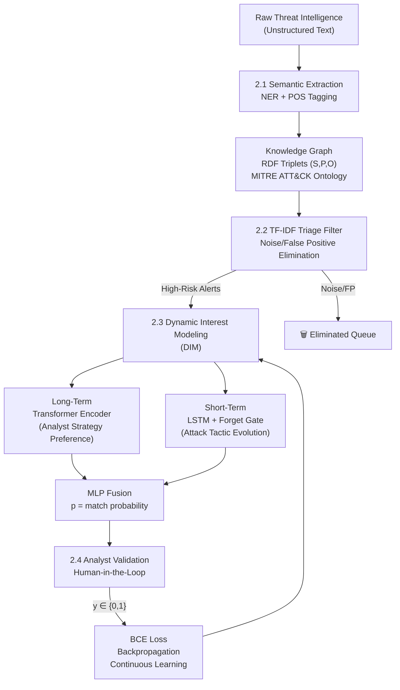

# Incident Response Playbook Recommendation System

Implementasi framework multi-modal untuk triase otomatis dan rekomendasi playbook respons insiden berdasarkan metodologi penelitian.

## Arsitektur Sistem

## Proposed Changes

### Module 1: Feature Extraction
#### [NEW] `src/feature_extraction/ner_extractor.py`
- SpaCy-based NER untuk ekstraksi entitas keamanan (malware, IP, CVE)
- POS Tagging untuk pemilahan informasi tekstual

#### [NEW] `src/feature_extraction/knowledge_graph.py`
- RDF triplet construction: (Subject, Predicate, Object)
- Integrasi MITRE ATT&CK ontology schema
- Dynamic graph construction

### Module 2: TF-IDF Triage
#### [NEW] `src/triage/tfidf_filter.py`
- Modified TF-IDF probability matrix
- Dual threshold: Max IDF + TF-IDF Multiplication
- Alert queue management

### Module 3: Dynamic Interest Modeling
#### [NEW] `src/models/dim.py`
- Embedding layer: discrete features → dense vectors
- Long-Term: Transformer Encoder (scaled dot-product attention)
- Short-Term: LSTM dengan forget gate
- MLP Fusion layer untuk output probabilitas p

### Module 4: Analyst Validation & Learning
#### [NEW] `src/validation/hitl_validator.py`
- Human-in-the-loop interface
- BCE Loss computation
- Backpropagation trigger untuk continuous learning

### Module 5: Evaluation
#### [NEW] `src/evaluation/metrics.py`
- Classification: Precision, Recall, F1, ROC-AUC
- Ranking: Hit Ratio, MAP, NDCG
- SOC Operational: MTTD, MTTR, Analyst Workload Reduction

### Entry Points & Utils
#### [NEW] `main.py` — Pipeline orchestration
#### [NEW] `src/data/dataset_loader.py` — BOTS/UNSW-NB15/CICIDS2017 loader + SMOTE
#### [NEW] `requirements.txt`

## Verification Plan
- Unit test tiap modul secara independen
- End-to-end pipeline test dengan synthetic data
